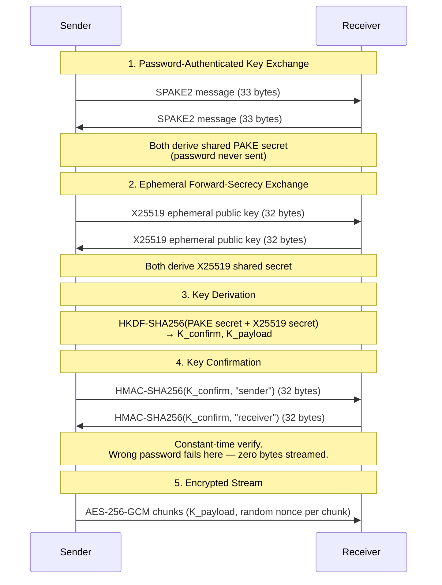

## 🦊 FoxPipe v2.0

**Secure • Simple • Reliable Data Streaming**

FoxPipe is a minimalist CLI tool for **end-to-end encrypted, optionally compressed data transfer** between two machines — no setup, no accounts, just a shared password.

**More about me / other projects:** [abhrankan.netlify.app](https://abhrankan.netlify.app)

> **v2.0** replaces the v1 handshake (a password-derived key sent implicitly over the wire) with a **PAKE-based** handshake providing forward secrecy. v2 is **not wire-compatible with v1** — both sides must be on v2. A version mismatch fails cleanly with an explicit error rather than silently downgrading.

---

## 🚀 Why FoxPipe?

**Simple**
No servers, no login. Just run sender and receiver.

**Efficient**
Built-in `zlib` streaming compression reduces bandwidth usage automatically.

**Secure by Design**
Uses a **SPAKE2 PAKE handshake** (never sends the password or a password hash over the wire) combined with an **ephemeral X25519 key exchange** for forward secrecy, then **AES-256-GCM (AEAD)** to encrypt the actual stream.

**Resilient**
Includes chunk limits, decompression guards, session validation, and timeouts.

---

## 📥 Installation

Install directly from PyPI:
```bash
pip install foxpipe
```

---

## 🛠️ Usage

### 1️⃣ Receiver (Destination)

Start this **first**:

```bash
foxpipe receive 8080 -p "secure-pass" > backup.sql
```

Allow external connections:

```bash
foxpipe receive 8080 -p "secure-pass" --public > backup.sql
```

---

### 2️⃣ Sender (Source)

```bash
cat backup.sql | foxpipe send 192.168.1.5 8080 -p "secure-pass"
```

---

## 📦 Advanced Usage

### 📁 Directory Transfer (Recommended)

```bash
# Sender
tar -cf - ./project | foxpipe send 1.2.3.4 9000 -p secret

# Receiver
foxpipe receive 9000 -p secret | tar -xf -
```

---

### 📄 Direct File Transfer

```bash
foxpipe send 1.2.3.4 8080 -p secret --file image.iso
```

---

### 🚫 Disable Compression

For already compressed files:

```bash
foxpipe send 1.2.3.4 8080 -p secret --file video.mp4 --no-compress
```

---

## 🔒 Security Model (v2.0)

* **Handshake:** SPAKE2 password-authenticated key exchange (symmetric, via the `spake2` library) — proves both sides know the shared password **without ever sending the password, or anything derived from it alone, over the wire**
* **Forward Secrecy:** an ephemeral X25519 key pair is generated fresh for every connection; the PAKE output and the X25519 shared secret are combined via **HKDF-SHA256** to derive the session key. A future password leak cannot decrypt previously captured sessions.
* **Key Confirmation:** before any data streams, each side sends `HMAC-SHA256(K_confirm, direction_label)` and verifies the peer's tag (constant-time comparison). A wrong password is caught **at the handshake**, with zero bytes streamed — not discovered later via a failed AES-GCM decrypt.
* **Encryption:** AES-256-GCM (authenticated encryption per chunk), keyed from the handshake's derived `K_payload`
* **Integrity & Authenticity:** provided by AES-GCM (AEAD) for data, and by the handshake's HMAC confirmation step for the session key itself

> v1's Scrypt-derived-key handshake is gone. It was vulnerable to offline dictionary attacks (the salt was sent in cleartext, and the same static password-derived key both authenticated *and* encrypted every session — no forward secrecy). v2's PAKE handshake closes both gaps.
>
> The random `session_id` is still sent on the wire but is no longer cryptographically load-bearing — every connection already gets a fresh, unique session key from the PAKE + X25519 exchange, which supersedes what session-ID binding was doing in v1. It's kept as informational metadata only.

---

## 🧭 Handshake Flow



Every step above is exactly what **Security Model (v2.0)** describes — this is just the same protocol laid out as a sequence rather than prose, to make the "no plaintext password, no data before confirmation" property easier to verify at a glance.

---

* **Max Chunk Size:** 10 MB
* **Session Timeout:** 300 seconds (idle)
* **Connection Timeout:** 15 seconds
* **Safe Streaming Decompression:** Protects against zip-bomb style attacks
* **DoS Protection:** Receiver enforces a global transfer limit (default **5GB**). 
  Adjust using `--limit` (e.g., `--limit 100` for 100GB).

---

## 🧠 Design Notes

* Uses **streaming compression (single zlib stream)**
* Uses **random nonce per chunk** (safe for AES-GCM usage)
* Uses **SPAKE2 (symmetric) + ephemeral X25519 + HKDF-SHA256** for session key derivation
* Uses **constant-time comparison** for the handshake's key-confirmation HMAC
* Avoids buffering entire files → supports large transfers
* Minimal protocol → low overhead, easy to audit
* Handshake messages are fixed-size (SPAKE2 message 33 bytes, X25519 pubkey 32 bytes, confirmation tag 32 bytes) — no length-prefixing needed for the handshake itself

---

## ⚡ Quick Example

```bash
# Receiver
foxpipe receive 9000 -p pass --public > file.txt

# Sender
foxpipe send <IP> 9000 -p pass --file file.txt
```

---

## ⚠️ Limitations

* Single connection only
* No resume support
* No file metadata (name/size handled externally)

---

## 🦊 Philosophy

> Build simple tools that are hard to misuse and easy to trust.
